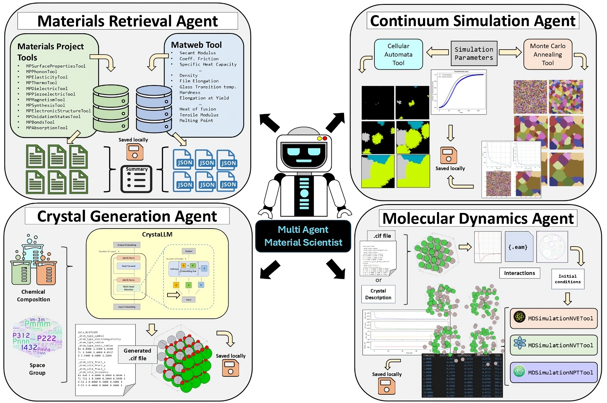

# Multi-Agent LLM Framework for Materials Science  

This research project introduces a multi-agent framework that integrates Large Language Models with specialized computational tools to tackle the challenges of materials analysis, simulation, and design. By combining the natural language reasoning capabilities of LLMs with the precision of domain-specific tools, we aim to show the potential to develop a robust, automated, and adaptable system for materials science workflows.

The system leverages LLMs to interpret user queries, synthesize information, and coordinate workflows, while task-specific agents perform computationally intensive operations. The architecture ensures flexibility and extensibility, making it a versatile solution for researchers and engineers.

At its core, the framework utilizes OpenAI's GPT-3.5-turbo, enhanced with custom prompts for domain-specific reasoning and tool integration. The modular design supports diverse tasks, including:

- Data extraction from databases like the Materials Project and MatWeb.
- Continuum simulations like cellular automata and Monte Carlo Potts models.
- Crystal structure generation using the CrystaLLM model.
- Molecular dynamics simulations using the Atomic Simulation Environment (ASE).

  

## Getting Started 
Create a virtual environment  

```bash
conda create -n matllm python=3.10
conda activate matllm
```

Clone the repository  

```bash
git clone https://github.com/cakshat/Multi-Agent-LLM-Framework-MatSci.git
cd Multi-Agent-LLM-Framework-MatSci
```  

Install the dependencies  

```bash
pip install -r requirements.txt
```  

For using crystallm, create a folder named `crystallm_v1_small` in the `crystallm` folder and download the model from [here](https://zenodo.org/records/10642388) and place it in the folder.  

Create a `.env` file in the root directory and add the following environment variables:  

```python
OPENAI_API
MP_API
```  

For using the agent, import the necessary agent and invoke it with your prompt. For example:    

```bash
>>> from agents import MatSciAgent
>>> mat_sci_agent = MatSciAgent()
>>> prompt = "Retrieve bond length and coordination information for TiO2. List your results."
>>> mat_sci_agent.invoke(prompt)
```

Responses will be generated based on the prompt and the agent's capabilities.
 ```bash
LLM Agent Selector Response:
I would recommend using the MaterialExtractionAgent with the MPBondsTool to retrieve bond length and coordination information for TiO2. This tool is specifically designed to extract bond-related properties from materials data.

MaterialExtractionAgent - MPBondsTool
Selected agent: MaterialExtractionAgent


> Entering new AgentExecutor chain...

Invoking: `get_material_ids` with `{'compound': 'TiO2'}`
responded: This query falls under Type 2, which involves getting properties of a specific material. The specified material is TiO2. To proceed, I will first need to find the material_id(s) for TiO2 by using the chemical formula. Let's start by retrieving the material_id(s) for TiO2.
...
Invoking: `MaterialsProjectBonds` with `{'material_ids': ['mp-390', 'mp-430', ...

The material studied in this analysis is a compound composed of oxygen (O) and titanium (Ti) atoms, with the chemical formula TiO2. The crystal structure is monoclinic with a volume of 274.62 ų and a density of 1.93 g/cm³. The coordination environments observed include various interactions between Ti and O atoms characterized as O2--Ti4+ and Ti4+-O2-. The bonding lengths range from 1.63 Å to 1.99 Å, with an average of 1.87 Å. The material exhibits coordination ... 

The analysis of TiO2 has provided detailed information on its bonding properties, coordination environments, and crystal structure. Here are some key findings for TiO2:

1. **Material ID: mp-572822**
   - Crystal Structure: Monoclinic
   - Volume: 274.62 ų
   - Density: 1.93 g/cm³
   - Coordination Environments: O2--Ti4+, Ti4+-O2-
   - Bond Lengths: Range from 1.63 Å to 1.99 Å

2. **Material ID: mp-636827**
   - Crystal Structure: Orthorhombic
   - Volume: 189.27 ų
   - Density: 1.40 g/cm³
   - Coordination Environments: O2--Ti4+, Ti4+-O2-

...

5. **Material ID: mp-754769**
   - Crystal Structure: Orthorhombic
   - Volume: 260.418 ų
   - Density: 4.074 g/cm³
   - Coordination Environments: O2--Ti4+, Ti4+-O2-
   - Bond Lengths: Range from 1.77 Å to 2.00 Å

These findings provide valuable insights into the bonding properties, coordination environments, and crystal structures of TiO2 across different material IDs. If you need more specific details or further analysis, feel free to ask!

> Finished chain.
 ```  

 Note: Create these folders for the agent to store the data: `materials_project_data`, `matweb_data`, `crystallm_cifs`, `continuum_simulation_results`, `md_simulation_results`. You can also modify the paths in the agent code if you want to store the data in a different location.  


## Agents  
The framework consists of the following agents:  

### Material Extraction Agent  
Integrates computational resources like the Materials Project and MatWeb for material discovery and analysis, providing real-time, authoritative data on properties like elasticity, phonons, and thermodynamics. Bridges the gap between theoretical models and experimental datasets, addressing the domain-specific limitations of traditional LLMs.  

### Continuum Simulation Agent  
Executes advanced simulations using Cellular Automata for phase transformations and Monte Carlo Annealing for microstructural evolution. Provides insights into grain growth, nucleation, and phase kinetics, offering actionable results and visualization for materials design.  

### Crystal Generation Agent  
Uses the CrystaLLM model to generate plausible crystal structures based on compositions or alloy systems. Captures crystallographic patterns to predict lattice parameters, atomic positions, and symmetry, enhancing workflows for materials design and stability evaluations.  

### Molecular Dynamics Agent  
Simulates atomic-scale phenomena using tools like ASE, supporting various interatomic potentials and conditions (NVE, NVT, NPT). Automates workflows from initialization to visualization, enabling natural language-based queries for studying thermodynamic and mechanical properties of materials.  