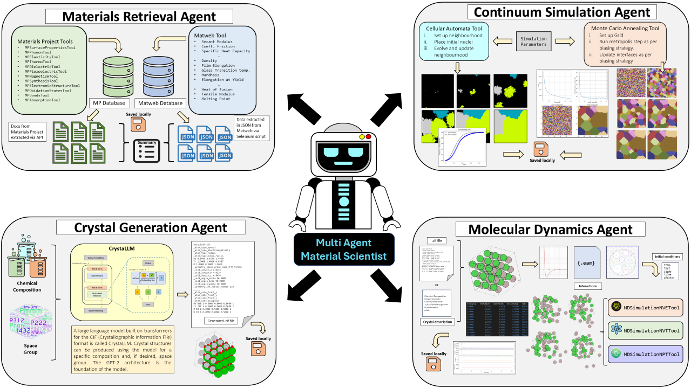

# Multi-Agent LLM Framework for Materials Science  

This research project introduces a multi-agent framework that integrates Large Language Models with specialized computational tools to tackle the challenges of materials analysis, simulation, and design. By combining the natural language reasoning capabilities of LLMs with the precision of domain-specific tools, we aim to show the potential to develop a robust, automated, and adaptable system for materials science workflows.

The system leverages LLMs to interpret user queries, synthesize information, and coordinate workflows, while task-specific agents perform computationally intensive operations. The architecture ensures flexibility and extensibility, making it a versatile solution for researchers and engineers.

At its core, the framework utilizes OpenAI's GPT-3.5-turbo, enhanced with custom prompts for domain-specific reasoning and tool integration. The modular design supports diverse tasks, including:

- Data extraction from databases like the Materials Project and MatWeb.
- Continuum simulations like cellular automata and Monte Carlo Potts models.
- Crystal structure generation using the CrystaLLM model.
- Molecular dynamics simulations using the Atomic Simulation Environment (ASE).

  

## Getting Started 
Create a virtual environment  

```bash
conda create -n matllm python=3.10
conda activate matllm
```

Clone the repository  

```bash
git clone https://github.com/cakshat/Multi-Agent-LLM-Framework-MatSci.git
cd Multi-Agent-LLM-Framework-MatSci
```  

Install the dependencies  

```bash
pip install -r requirements.txt
```  

For using crystallm, create a folder named `crystallm_v1_small` in the `crystallm` folder and download the model from [here](https://zenodo.org/records/10642388) and place it in the folder.  

Create a `.env` file in the root directory and add the following environment variables:  

```python
OPENAI_API
MP_API
```  

For using the agent, import the necessary agent and invoke it with your prompt. For example:    

```bash
>>> from agents.material_extraction_agent import MaterialExtractionAgent
>>> mea = MaterialExtractionAgent()
>>> mea.invoke("Retrieve materials with Poisson's ratios ranging from 0.2 to 0.35, list their poissons ratios along with other elastic properties")  
```

Responses will be generated based on the prompt and the agent's capabilities.
 ```bash
> Entering new AgentExecutor chain...
Invoking: `MaterialsProjectElasticity` with `{'poisson_ratio': [0.2, 0.35], ...
...
The search for materials with Poisson's ratios ranging from 0.2 to 0.35 has provided several materials with their elastic properties. Here are some of the materials found along with their elastic properties:

1. Silicon (Si):
   - Poisson's Ratio: 0.318
   - Bulk Modulus: 67.85 GPa
   - Shear Modulus: 28.05 GPa
   - Anisotropy: 2.66

2. Oxygen (O₂):
   - Poisson's Ratio: 0.318
   - Bulk Modulus: 1.74 GPa
   - Shear Modulus: 1.04 GPa
   - Anisotropy: -17.18

...

5. Carbon (C):
   - Poisson's Ratio: 0.31
   - Bulk Modulus: 45.5 GPa
   - Shear Modulus: 30.7 GPa
   - Anisotropy: -3.046

These materials exhibit a range of elastic properties and can be further analyzed for specific applications requiring materials with these characteristics.

> Finished chain.
 ```  

 Note: Create these folders for the agent to store the data: `materials_project_data`, `matweb_data`, `crystallm_cifs`, `continuum_simulation_results`, `md_simulation_results`. You can also modify the paths in the agent code if you want to store the data in a different location.  


## Agents  
The framework consists of the following agents:  

### Material Extraction Agent  
The Material Extraction Agent is designed to bridge the gap between theoretical models and practical 
applications in materials science. By integrating structured computational resources like the Materials 
Project (MP) and experimental databases such as MatWeb, it provides a robust framework for material 
discovery and analysis. The MP offers access to over 150,000 known and predicted materials, with detailed 
properties like elasticity, phonons, and thermodynamics, while MatWeb serves as a repository for experimentally 
validated material properties, ensuring direct comparisons between predicted and real-world behaviors. 
This integration addresses a key challenge in materials science, as traditional large language models
 often lack the domain-specific knowledge required for interpreting highly specialized datasets. 
 The Material Extraction Agent mitigates this by embedding dynamic querying mechanisms to access real-time data,
  ensuring responses grounded in authoritative, up-to-date information.  

### Continuum Simulation Agent  
The Continuum Simulation Agent is designed to execute advanced materials science simulations, integrating two 
powerful modeling techniques: Cellular Automata (CA) and Monte Carlo Annealing (MCA). By utilizing CA, the agent 
simulates phase transformations such as solidification and recrystallization on a 2D grid, iteratively updating 
the grid based on local neighborhood conditions. This approach provides valuable insights into grain growth, 
nucleation behaviors, and the kinetics of phase changes in both single-phase and multiphase systems. MCA, particularly 
with the Potts model, is used to analyze microstructural evolution during annealing. It simulates grain structure 
evolution under thermal processing conditions, applying biasing strategies to model interface and bulk site behaviors, 
and offering predictive insights into grain boundary dynamics and energy minimization. By combining real-time computational modeling with natural language processing, the Continuum Simulation 
Agent provides actionable simulation results and enables seamless interaction, parameter customization, and visualization, 
bridging the gap between theoretical insights and practical applications in materials design and manufacturing.  

### Crystal Generation Agent  
The Crystal Generator Agent leverages the CrystaLLM model, a transformer-based architecture specifically optimized 
for materials science, to generate crystal structures based on elemental compositions or alloy systems. Trained on a 
large dataset of known crystal structures and material properties, CrystaLLM predicts stable or plausible crystal structures, 
including lattice parameters, atomic positions, and symmetry information. This capability facilitates advanced materials 
design, such as alloys, superconductors, or energy storage solutions, by generating multiple plausible structures for a given 
composition. Unlike general-purpose LLMs, CrystaLLM captures complex crystallographic patterns, enabling the generation of 
physically meaningful structures. Integrated within a multi-agent system, the Crystal Generator Agent enhances material
 discovery workflows by producing results that can seamlessly be passed on for further processing, including evaluations of
  thermodynamic stability, material properties, or molecular dynamics simulations.  

### Molecular Dynamics Agent  
The Molecular Dynamics (MD) Simulation Agent is a powerful computational tool designed to simulate atomic-scale phenomena, 
leveraging the Atomic Simulation Environment (ASE) package for structure initialization, interatomic potential definition, 
and simulation execution. Supporting various crystal symmetries and interatomic potentials like the Embedded Atom Method (EAM), 
Lennard-Jones (LJ), and Effective Medium Theory (EMT), the agent allows simulations of metals, alloys, and simple systems. 
It can simulate under different conditions, including NVE (constant energy), NVT (constant temperature), and NPT (constant pressure), 
enabling users to investigate thermodynamic properties under controlled settings. This versatility makes the MD Simulation Agent 
essential for studying material behaviors such as thermal conductivity, mechanical strength, and phase transitions at the atomic level.  Integrated within a large language model framework, the agent enhances usability by enabling interactive, natural language-based queries, configuration, and analysis of simulations. Unlike traditional MD tools, this agent automates the entire simulation workflow, from initialization to visualization, providing actionable insights and detailed outputs, such as energy plots and trajectory data, making it an indispensable tool for materials science research and engineering.